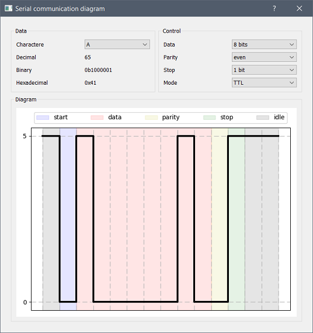

# serial-communication-diagram
## About

A simple PyQt interface for plotting the timing diagram of an asynchronous serial communication sending a specified ASCII character.

The interface include options to change the following properties : data format (7 or 8 bits), parity (none, even, odd), number of stop bits (1 or 2) and mode (TTL or RS232).

## Prerequisites

```
pip install numpy matplotlib pyqt5
```

## Screenshot

